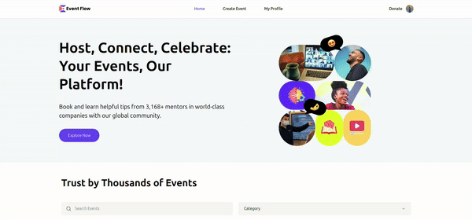
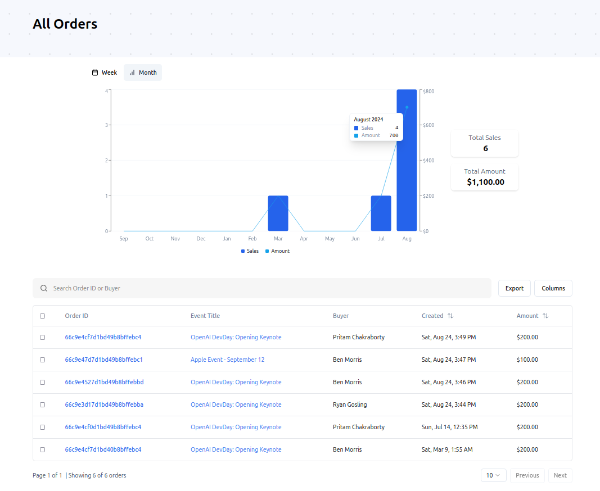
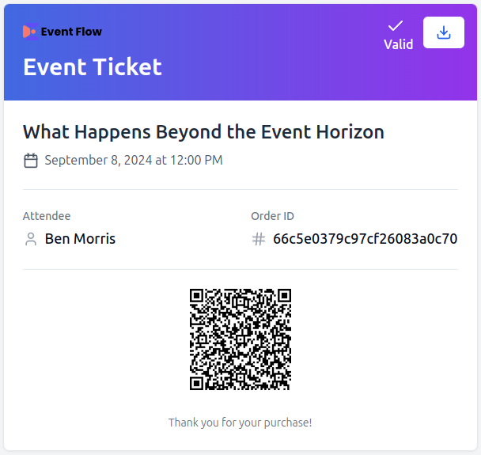

<p align="center">
  
</p>

# Event Flow

[](https://react.dev/)
[](https://nextjs.org/)
[](https://www.typescriptlang.org/)
[](https://tailwindcss.com/)
[](https://www.mongodb.com/lp/cloud/atlas/try4?utm_content=controlhterms&utm_source=google&utm_campaign=search_gs_pl_evergreen_atlas_core_prosp-brand_gic-null_emea-pl_ps-all_desktop_eng_lead&utm_term=mongodb&utm_medium=cpc_paid_search&utm_ad=e&utm_ad_campaign_id=12212624548&adgroup=115749720623&cq_cmp=12212624548&gad_source=1&gclid=Cj0KCQjw5ea1BhC6ARIsAEOG5pxTAlQ4bkZdAZuggDCcisw-xncyF4Lij1j2P8vsXqWClLK9sFuTyoUaAr0REALw_wcB)
[](https://clerk.dev/)
[](https://stripe.com/)

_Deployed Version: [EVENT-FLOW](https://event-flow-alpha.vercel.app)_

#### Test Account

For testing, use these credentials or create your own account:

- **Username:** `harrypotter`
- **Password:** `harrypotterinnit`

#### Stripe Test Card Information

When performing interactive testing, you can use the following test card details:

- **Card Number:** `4242 4242 4242 4242`
- **Expiration Date:** Any valid future date (e.g., `12/34`)
- **CVC:** Any three-digit code (e.g., `123`).
- **Other Fields:** Any value can be used for the remaining form fields.

---

This platform is **100% mobile responsive** and designed with a **mobile-first approach**, ensuring a seamless experience on devices of all sizes.

## Overview

This Events application is built using Next.js. The app features a full-fledged event management system where users can create, view, manage and purchase tickets for events. The Platform integrates Stripe for payment processing and QR code scanning for secure ticket validation, offering a seamless experience for both event organizers and attendees. Additionally, event organizers have access to detailed analytics, including weekly and monthly sales charts and an interactive orders table, providing valuable insights into event performance.

## Table of Contents

1. [Features](#features)
2. [Technologies](#technologies)
3. [Usage](#usage)
4. [Installation](#installation)
5. [Environment Variables](#environment-variables)
6. [Database Models](#database-models)
7. [Server Actions](#server-actions)
8. [Event Ticket Overview](#event-ticket-overview)
9. [File Uploads](#file-uploads)
10. [Contributing](#contributing)
11. [License](#license)

## Features

### Event Management

- Users have the ability to create, update, and delete events.
- Event organizers can easily view detailed order information for individual events or all orders, including comprehensive ticket sales `analytics`. Access insights through interactive `weekly` and `monthly` charts, as well as a detailed orders table, for a complete overview of event performance.
- Export Sales report as CSV, Excel, PDF, JSON.



### Ticket Purchase and Validation

- Users can purchase tickets for events via `Stripe`.
- Organizers can `validate and mark` tickets as used through a QR code system.
- Downloadable tickets in image format for easy sharing and validation.

### Event Discovery

- Search and filter events by category.
- The platform also `suggests related events` based on categories.
- View other user profiles to explore events they have organized.

## Technologies

- **Next.js**: Framework for building server-rendered React applications.
- **TypeScript**: Ensures type safety and improves code quality.
- **MongoDB**: NoSQL database for storing application data.
- **Mongoose**: ODM for MongoDB, used to define schemas and interact with the database.
- **Tailwind CSS**: Utility-first CSS framework for responsive design.
- **Clerk**: User authentication service.
- **Stripe**: Payment processing for managing event orders.
- **UploadThing**: Service for handling file uploads.
- **Shadcn UI**: Set of pre-built UI components.
- **React Hook Form**: Library for flexible and efficient form handling.
- **Zod**: TypeScript-first schema declaration and validation library.

## Usage

Here's how you can navigate and use the key features within the app:

### Browsing Events

- On the homepage, users can browse various events.
- Events can be filtered by name or category for easier discovery.
- Click on an event card to view more details about the specific event and related events.

### Event Details

- The event details page provides comprehensive information about the event.
- Related events are suggested based on the current event's category.

### Purchasing Tickets

- Users need to log in to buy tickets for any event.
- After selecting an event, follow the prompts to complete the purchase through secure Stripe integration.

### User Authentication

- Log in or sign up using the "Login" button in the header navigation bar.

### Creating an Event

1. After logging in, access the "Create Event" option from the header nav bar or hamburger menu in the top-right corner (mobile).
2. Provide the following event details:
   - Event title
   - Description
   - Category
   - Event image
   - Event location (online or physical venue)
   - Start and end date/time
   - Event URL
3. Click the "Create Event" button to submit.
4. Upon successful creation, you'll be directed to the newly created event's page.

### Managing Events

- As an event organizer, you can edit or delete your events using the respective buttons on the event page.
- These options are available for events you've created, both on the event page and in your profile.

### Organizer Pages

- Clicking on an event organizer's name (displayed on event cards or event detail pages) will take you to the organizer's page.
- Here, you can view all events organized by that particular organizer.

### User Profile

- Access your profile page through the header nav buttons.
- On your profile, you can view:
  - Tickets you've purchased
  - Events you've organized
- For events you've created:
  - Use the edit/delete buttons to manage the events.
  - Click the "Orders Details" button on event cards to view order/sales details and analytics for that specific event.
- An "All Orders" button is available to see order/sales details and analytics for all events you've created.

### Orders and Sales Analytics

- On the analytics page, you'll find a chart displaying sales data:
  - The line represents the amount/money earned.
  - The bar represents the number of sales.
- Switch between monthly and weekly views:
  - Monthly view displays data for 12 months.
  - Weekly view includes navigation buttons for previous/next week.
- Below the chart, there's a detailed orders table where you can:
  - Search for an order by buyer name.
  - Sort orders by date placed (ascending/descending) or amount.
  - Export data as CSV, Excel, PDF, or JSON.
  - Filter displayed columns using the columns button.

### Ticket Management

For Event Attendees:

- In the "My Tickets" section of your profile, you'll see event cards for purchased tickets.
- Each card has a QR code button. Clicking this will display:
  - The QR code for the ticket.
  - An option to view and download the actual ticket.
- Show this QR code to event organizers for entry validation.

For Event Organizers:

- When an attendee presents their QR code, scan it using your phone's camera or a QR code scanner.
- This will redirect you to the ticket validation page within the Event Flow app.
- The system performs robust server-side validation to check ticket validity.
- You can manually mark tickets as used or set up auto-marking upon scanning.

By following these steps, you can fully engage with the Event Flow platform, whether you're looking to attend events or organize your own.

## Installation

### Prerequisites

- Node.js v14+ and npm.
- MongoDB instance.
- Stripe account for payment processing.
- Clerk account for user authentication.

### Steps

1. **Clone the repository**:

   ```bash
   git clone https://github.com/itssodope01/Event-Flow.git
   cd Event-Flow
   ```

2. **Install dependencies**:

   ```bash
   npm install
   ```

3. **Set up environment variables**:

   Create a `.env.local` file in the root of the project and configure it with your credentials. See the [Environment Variables](#environment-variables) section for required variables.

4. **Run the application**:

   ```bash
   npm run dev
   ```

   The app will be available at `http://localhost:3000`.

## Environment Variables

Configure the following environment variables in your `.env.local` file:

```env
# Clerk
NEXT_PUBLIC_CLERK_PUBLISHABLE_KEY=your-public-clerk-publishable-key
CLERK_SECRET_KEY=your-clerk-secret-key

NEXT_PUBLIC_CLERK_SIGN_IN_URL=/sign-in
NEXT_PUBLIC_CLERK_SIGN_UP_URL=/sign-up

WEBHOOK_SECRET=your-clerk-webhook-secret

# MongoDB
MONGODB_URI=your-mongodb-uri

# UploadThing
UPLOADTHING_SECRET=your-uploadthing-secret
UPLOADTHING_APP_ID=your-uploadthing-app-id

# Stripe
NEXT_PUBLIC_STRIPE_PUBLISHABLE_KEY=your-public-stripe-publishable-key
STRIPE_SECRET_KEY=your-stripe-secret-key

STRIPE_WEBHOOK_SECRET=your-stripe-webhook-secret

# Next.js Public Server URL
NEXT_PUBLIC_SERVER_URL=http://localhost:3000/ (or your deployed site URL)

# Location API (https://rapidapi.com/gmapplatform/api/google-map-places)
NEXT_PUBLIC_LOCATION_API=your-geo-location-api-key


```

## Database Models

The app uses Mongoose for defining database schemas. Below are the key models:

- **User**: Manages user details including authentication via Clerk.
- **Event**: Stores event details such as title, description, location, and organizer.
- **Category**: Used for categorizing events.
- **Order**: Captures transactions linking users to events they’ve registered for, including details like payment and ticket usage status.

## Server Actions

The app uses server actions in Next.js, defined with `use server`, to interact with the MongoDB database. These server-side actions handle data fetching and manipulation while enforcing robust security measures to ensure data integrity and user authorization.

### Authorization Checks

All server actions involving data modifications or retrieval of sensitive data incorporate strict authorization checks. These checks verify that the user initiating the action has the necessary permissions.

**Example: Event Deletion**

```typescript
export async function deleteEvent({
  eventId,
  path,
  userId,
}: DeleteEventParams) {
  try {
    if (
      !isValidObjectId(userId) ||
      !isValidObjectId(eventId) ||
      typeof path !== "string"
    ) {
      throw new Error("Invalid input parameters.");
    }

    const { sessionClaims } = auth();
    const sessionUser = sessionClaims?.userId as string;

    // Check if the user is authorized
    if (userId !== sessionUser) {
      throw new Error("User is not authorized to delete this event.");
    }

    await connectToDatabase();

    const event = await Event.findById(eventId).populate("organizer");

    // Check if the event exists and if the user is the organizer
    if (!event) {
      throw new Error("Event not found.");
    }

    if (event.organizer._id.toHexString() !== userId) {
      throw new Error("User is not authorized to delete this event.");
    }

    const deletedEvent = await Event.findByIdAndDelete(eventId);

    if (deletedEvent) {
      revalidatePath(path);
      return { success: true, message: "Event deleted successfully." };
    } else {
      throw new Error("Failed to delete the event.");
    }
  } catch (error) {
    handleError(error);
    return { success: false, message: (error as Error).message };
  }
}
```

In this `deleteEvent` action:

1. Input Validation: The function first validates inputs to ensure `userId` and `eventId` are valid MongoDB Object IDs and path is a string. This prevents invalid data from causing errors or security issues.
2. Authorization Check: It retrieves the current user’s ID from the session claims and verifies it against the provided userId. If they don’t match, an "Unauthorized" error is thrown. Additionally, it ensures that the event being deleted is associated with the correct organizer by comparing the userId with the event organizer’s ID.
3. Database Connection: The function establishes a connection to the database before performing any operations.
4. Event Deletion: If the user is authorized, the event is deleted. After successful deletion, it calls `revalidatePath` to maintain UI consistency and returns a success message.
5. Error Handling: Errors are caught and handled by `handleError`, ensuring that any issues are logged or managed appropriately.

### Implementation Across the Application

This pattern is consistently applied across all server actions involving data modification or retrieval of sensitive information, including but not limited to:

- Creating and updating events
- Processing orders
- Order Sales Analytics

By implementing these security measures at the server action level, the app provides a secure and robust foundation for data management.

## Event Ticket Overview

Event tickets are designed for both user convenience and security, featuring unique QR codes for seamless scanning and validation.



### Ticket Validation Process

For event organizers, ticket validation is seamlessly integrated into their account. Here's how it works:

1. **Organizer Access**: Logged-in users who have published an event can scan the QR code to mark tickets for their event as used directly through the platform.

2. **Server-Side Validation**:
   - **Automatic Verification**: Each time a ticket's QR code is scanned, the system performs robust server-side validation.
   - **Validation Criteria**:
     - **Order ID**: Confirms the ticket belongs to a valid order.
     - **Event ID**: Ensures the ticket is associated with the correct event.
     - **Organizer ID**: Grants event hosts access to validate tickets and mark them as used.
     - **Event End Date**: Checks that the event has not expired.
     - **Usage Status**: Verifies whether the ticket has already been used.

This robust validation process ensures that only legitimate tickets are accepted, offering peace of mind to organizers and attendees alike.

## File Uploads

For uploading event images, the app uses [UploadThing](https://uploadthing.com/). The integration is seamless and supports various file types.

## Contributing

Contributions are welcome! Please fork the repository and submit a pull request for any enhancements or bug fixes.

## License

This project is licensed under the MIT License. See the [LICENSE](LICENSE.md) file for more details.
