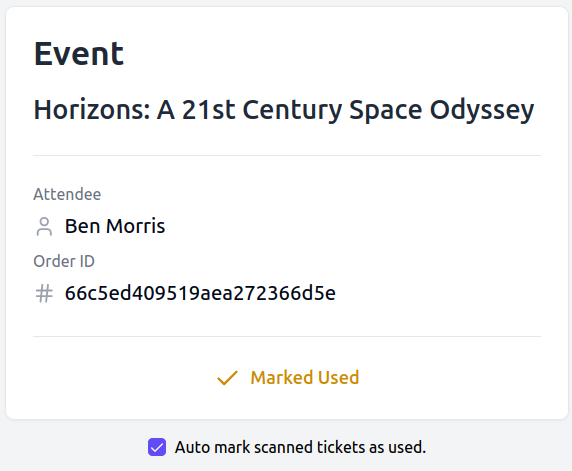
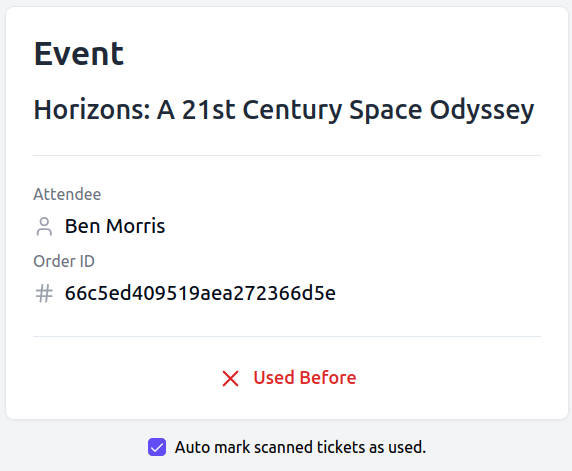

# Event Flow

[](https://react.dev/)
[](https://nextjs.org/)
[](https://www.typescriptlang.org/)
[](https://tailwindcss.com/)
[](https://www.mongodb.com/lp/cloud/atlas/try4?utm_content=controlhterms&utm_source=google&utm_campaign=search_gs_pl_evergreen_atlas_core_prosp-brand_gic-null_emea-pl_ps-all_desktop_eng_lead&utm_term=mongodb&utm_medium=cpc_paid_search&utm_ad=e&utm_ad_campaign_id=12212624548&adgroup=115749720623&cq_cmp=12212624548&gad_source=1&gclid=Cj0KCQjw5ea1BhC6ARIsAEOG5pxTAlQ4bkZdAZuggDCcisw-xncyF4Lij1j2P8vsXqWClLK9sFuTyoUaAr0REALw_wcB)
[](https://clerk.dev/)
[](https://stripe.com/)

_Deployed Version: [EVENT-FLOW](https://event-flow-alpha.vercel.app)_

This platform is **100% mobile responsive** and designed with a **mobile-first approach**, ensuring a seamless experience on devices of all sizes.

## Overview

This Events application is built using Next.js. The app features a full-fledged event management system where users can create, view, manage and purchase tickets for events. The platform acts as a dynamic marketplace for events where users can discover and engage with events that interest them. Additionally, it integrates Stripe for payment processing and QR code scanning for secure ticket validation, offering a seamless experience for both event organizers and attendees.

## Table of Contents

1. [Features](#features)
2. [Technologies](#technologies)
3. [Installation](#installation)
4. [Environment Variables](#environment-variables)
5. [Database Models](#database-models)
6. [Server Actions](#server-actions)
7. [Event Ticket Overview](#event-ticket-overview)
8. [File Uploads](#file-uploads)
9. [Contributing](#contributing)
10. [License](#license)

## Features

### Event Management:

- Users can `create`, `update`, and `delete` events.
- Event organizers can view detailed order information, including attendee details and `ticket sales`.

### Ticket Purchase and Validation:

- Users can purchase tickets for events via `Stripe`.
- Organizers can `validate and mark` tickets as used through a QR code system.
- Downloadable tickets in image format for easy sharing and validation.

### Event Discovery:

- Search and filter events by category.
- The platform also `suggests related events` based on categories.
- View other user profiles to explore events they have organized.

## Technologies

- **Next.js**: Framework for building server-rendered React applications.
- **TypeScript**: Ensures type safety and improves code quality.
- **MongoDB**: NoSQL database for storing application data.
- **Mongoose**: ODM for MongoDB, used to define schemas and interact with the database.
- **Clerk**: User authentication service.
- **Stripe**: Payment processing for managing event orders.
- **UploadThing**: Service for handling file uploads.
- **Shadcn UI**: Set of pre-built UI components.
- **Tailwind CSS**: Utility-first CSS framework for responsive design.

## Installation

### Prerequisites

- Node.js v14+ and npm.
- MongoDB instance.
- Stripe account for payment processing.
- Clerk account for user authentication.

### Steps

1. **Clone the repository**:

   ```bash
   git clone https://github.com/itssodope01/Event-Flow.git
   cd Event-Flow
   ```

2. **Install dependencies**:

   ```bash
   npm install
   ```

3. **Set up environment variables**:

   Create a `.env.local` file in the root of the project and configure it with your credentials. See the [Environment Variables](#environment-variables) section for required variables.

4. **Run the application**:

   ```bash
   npm run dev
   ```

   The app will be available at `http://localhost:3000`.

## Environment Variables

Configure the following environment variables in your `.env.local` file:

```env
# Clerk
NEXT_PUBLIC_CLERK_PUBLISHABLE_KEY=your-public-clerk-publishable-key
CLERK_SECRET_KEY=your-clerk-secret-key

NEXT_PUBLIC_CLERK_SIGN_IN_URL=/sign-in
NEXT_PUBLIC_CLERK_SIGN_UP_URL=/sign-up

WEBHOOK_SECRET=your-clerk-webhook-secret

# MongoDB
MONGODB_URI=your-mongodb-uri

# UploadThing
UPLOADTHING_SECRET=your-uploadthing-secret
UPLOADTHING_APP_ID=your-uploadthing-app-id

# Stripe
NEXT_PUBLIC_STRIPE_PUBLISHABLE_KEY=your-public-stripe-publishable-key
STRIPE_SECRET_KEY=your-stripe-secret-key

STRIPE_WEBHOOK_SECRET=your-stripe-webhook-secret

# Next.js Public Server URL
NEXT_PUBLIC_SERVER_URL=http://localhost:3000/ (or your deployed site URL)

# Location API (https://rapidapi.com/gmapplatform/api/google-map-places)
NEXT_PUBLIC_LOCATION_API=your-geo-location-api-key


```

## Database Models

The app uses Mongoose for defining database schemas. Below are the key models:

- **User**: Manages user details including authentication via Clerk.
- **Event**: Stores event details such as title, description, location, and organizer.
- **Category**: Used for categorizing events.
- **Order**: This model tracks transactions, linking users to the events they've registered for. It also includes a field to record whether the tickets associated with a particular order have been marked as used, ensuring accurate tracking of ticket usage.

## Server Actions

The app utilizes server actions to interact with the MongoDB database. These actions are defined using `use server` in Next.js, ensuring that data fetching and manipulation happen server-side.

### Examples

- **Creating a Category**:

  ```typescript
  import { CreateCategoryParams } from "@/app/types";
  import { connectToDatabase } from "../database";
  import Category from "../database/models/category.model";

  export const createCategory = async ({
    categoryName,
  }: CreateCategoryParams) => {
    await connectToDatabase();
    const newCategory = await Category.create({ name: categoryName });
    return newCategory;
  };
  ```

## Event Ticket Overview

Event tickets are designed for both user convenience and security, featuring unique QR codes for seamless scanning and validation.


### Ticket Validation Process

For event organizers, ticket validation is a seamless process integrated into the organizer's account. Here's how it works:

1. **Organizer Access**: When logged in, users who have published an event can scan the QR Code to mark tickets for their event as used directly through the platform.

2. **Server-Side Validation**:
   - **Automatic Verification**: Each time a ticket's QR code is scanned, the system performs a robust server-side validation.
   - **Validation Criteria**:
     - **Order ID**: Confirms the ticket belongs to a valid order.
     - **Event ID**: Ensures the ticket is associated with the correct event.
     - **Organizer ID**: Grants access to event hosts to validate tickets and mark them as used.
     - **Event End Date**: Checks that the event has not expired.
     - **Usage Status**: Verifies whether the ticket has already been used.

This robust validation process ensures only legitimate tickets are accepted, offering peace of mind for organizers and attendees alike.





## File Uploads

For uploading event images, the app uses UploadThing. The integration is seamless and supports various file types.

### Example Usage

```typescript
import { useUploadThing } from "@uploadthing/react";

export const uploadEventImage = async (file: File) => {
  const { data } = await useUploadThing("YOUR_UPLOADTHING_ENDPOINT", file);
  return data;
};
```

## Contributing

Contributions are welcome! Please fork the repository and submit a pull request for any enhancements or bug fixes.

## License

This project is licensed under the MIT License. See the [LICENSE](LICENSE.md) file for more details.
